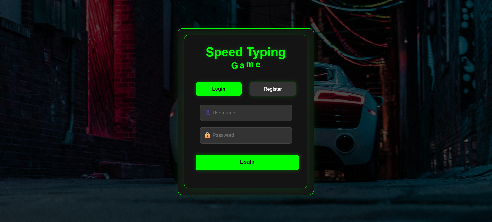
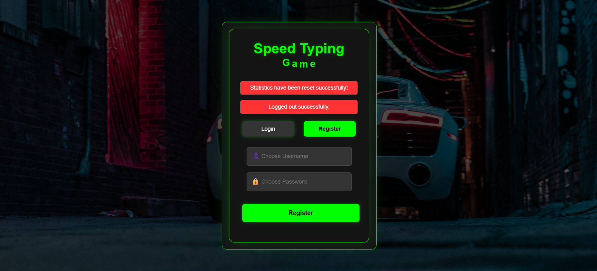
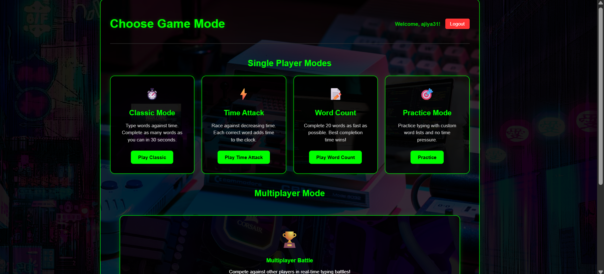
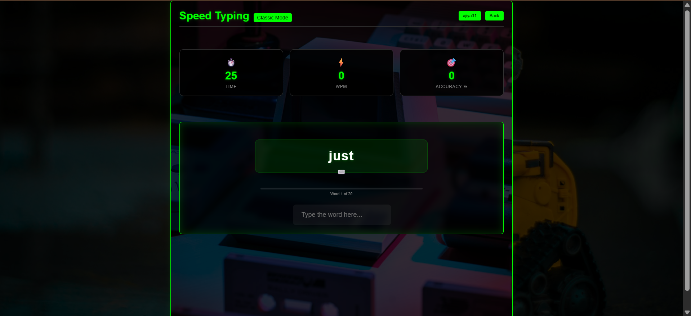
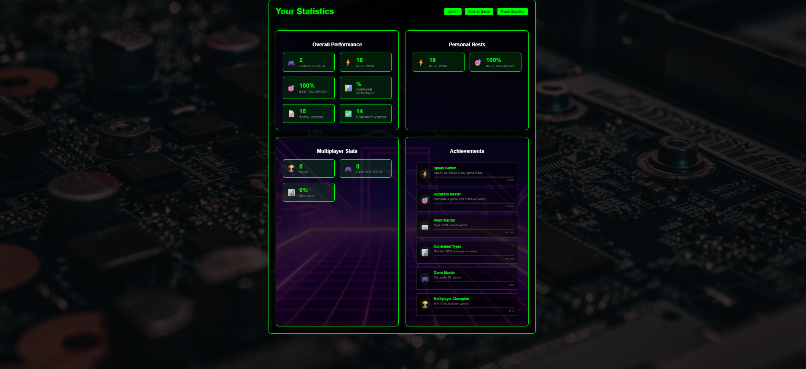

# Speed Typing Game

A Flask-based typing game with login and registration, multiple game modes, practice sessions, multiplayer support, achievements, statistics, and leaderboards.

## Screenshots

### Login



### Registration



### Game Modes



### Active Classic Game



### Statistics Dashboard



## Features

- Classic, time attack, and word count game modes
- Practice mode with custom word lists
- Multiplayer lobby and matches
- WPM and accuracy tracking
- Achievements and statistics
- Leaderboards
- Persistent user data stored in `data/users.pkl`

## Requirements

- Python 3.10 or newer
- Flask
- Windows PowerShell, macOS Terminal, or Linux shell

## Run Locally on Windows

Open PowerShell in the project folder:

```powershell
cd "C:\Users\Admin\Documents\game\typing game"
.\venv\Scripts\python.exe -m pip install -r requirements.txt
.\venv\Scripts\python.exe main.py
```

Then open:

```text
http://127.0.0.1:5000
```

If you do not have a virtual environment yet:

```powershell
python -m venv venv
.\venv\Scripts\python.exe -m pip install -r requirements.txt
.\venv\Scripts\python.exe main.py
```

## Run on macOS or Linux

```bash
python3 -m venv venv
./venv/bin/python -m pip install -r requirements.txt
./venv/bin/python main.py
```

Open `http://127.0.0.1:5000` in your browser.

## Project Structure

```text
.
├── data/
│   ├── achievements.json
│   └── word_lists.json
├── screenshots/
│   ├── login.png
│   └── register.png
├── static/
│   └── css/
├── templates/
├── main.py
└── requirements.txt
```
## Project Ownership

This project was designed and developed by **Ajiya Shaukat**. I retain the rights to the original source code, design, and project implementation.

© 2026 Ajiya Shaukat. All rights reserved.
